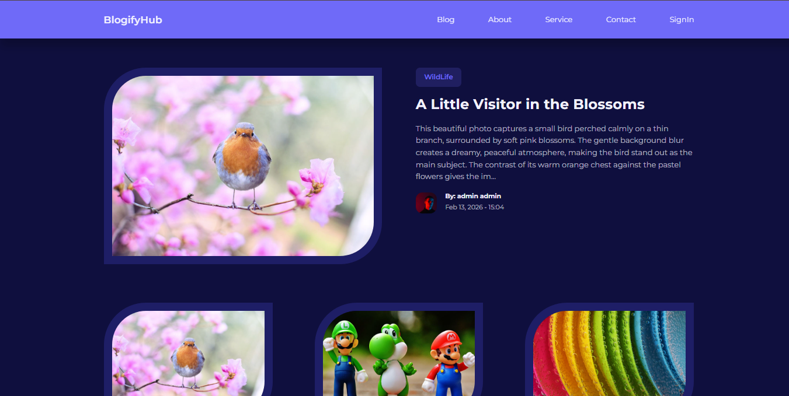
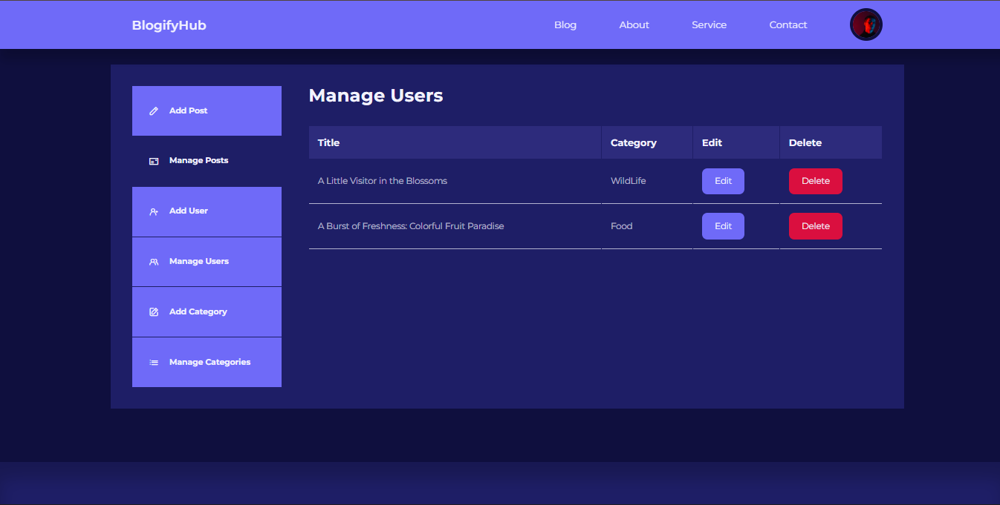

# 📝 Blogging Website


A dynamic and responsive **Full Stack Blogging Platform** built using **HTML, CSS, JavaScript, PHP, and PostgreSQL**.  
The application allows users to register, log in, create blog posts, manage content, and browse posts with category filtering.

---

## 🚀 Features

- 🔐 User Authentication (Register/Login/Logout)
- ✍️ Create, Edit, and Delete Blog Posts (CRUD)
- 🗂️ Category-Based Blog Filtering
- 🔎 Search Functionality
- 📱 Responsive Design (Mobile-Friendly)
- 🛠️ Admin Dashboard for Managing Posts & Users
- 💾 PostgreSQL Database Integration
- 🔒 Secure Session Handling & Server-Side Validation

---

## 🛠️ Tech Stack

| Layer | Technology |
|-------|------------|
| Frontend | HTML5, CSS3, JavaScript |
| Backend | PHP |
| Database | PostgreSQL |
| Version Control | Git & GitHub |

---

## 📸 Screenshots

### 🏠 Homepage


---

### 🔐 Login Page


---

### 📝 Admin Dashboard


---

## 📁 Project Structure

```
Blogging-Website/
│
├── admin/
├── config/
├── css/
├── js/
├── images/
│   ├── homepage.png
│   ├── login.png
│   └── admin-dashboard.png
├── database/
├── partials/
├── index.php
├── blog.php
├── about.php
└── README.md
```

---

## ⚙️ Installation & Setup

### 1️⃣ Clone Repository

```bash
git clone https://github.com/pratik2704-cmd/Blogging-Website.git
cd Blogging-Website
```

### 2️⃣ Setup PostgreSQL Database

```sql
CREATE DATABASE blog_db;
```

### 3️⃣ Configure Database Connection

```php
<?php
$conn = pg_connect("host=localhost dbname=blog_db user=postgres password=yourpassword");
if(!$conn){
    echo "Database connection failed";
}
?>
```

### 4️⃣ Run the Project

- Place inside XAMPP/WAMP/Laragon `htdocs` folder
- Start Apache & PostgreSQL
- Open:

```
http://localhost/Blogging-Website
```

---

## 📈 Project Highlights

- Implemented Full CRUD operations using PHP
- Designed relational database using PostgreSQL
- Developed modular backend structure
- Applied responsive UI principles
- Secured authentication using sessions & validation

---

## 📜 License

This project is open-source under the MIT License.

---

⭐ If you like this project, consider giving it a star!
